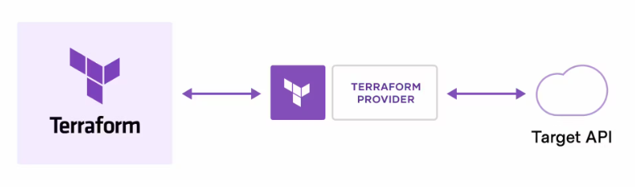
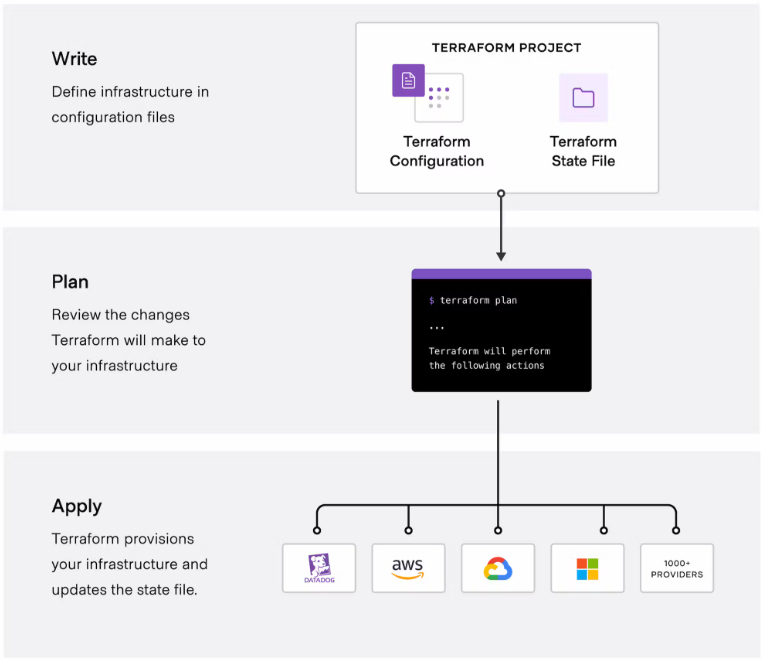

# Terraform:

Terraform is an open-source infrastructure as code (IaC) tool created by HashiCorp. It allows users to define and provision infrastructure in a declarative configuration language. With Terraform, you can describe your infrastructure, such as servers, databases, networking components, and other resources, in a configuration file, and then use Terraform to create and manage those resources across various cloud providers or on-premises environments.

### How does Terraform work?
Terraform creates and manages resources on cloud platforms and other services through their application programming interfaces (APIs). Providers enable Terraform to work with virtually any platform or service with an accessible API.

The core Terraform workflow consists of three stages:

**Write:** You define resources, which may be across multiple cloud providers and services. For example, you might create a configuration to deploy an application on virtual machines in a Virtual Private Cloud (VPC) network with security groups and a load balancer.

**Plan:** Terraform creates an execution plan describing the infrastructure it will create, update, or destroy based on the existing infrastructure and your configuration.

**Apply:** On approval, Terraform performs the proposed operations in the correct order, respecting any resource dependencies. For example, if you update the properties of a VPC and change the number of virtual machines in that VPC, Terraform will recreate the VPC before scaling the virtual machines

### aws Provider:
When you write Terraform configurations, you specify which provider you want to use for the resources you are defining. Providers enable Terraform to manage resources in various environments. Some common providers include AWS, Azure, Google Cloud Platform (GCP), VMware, and many others.

#### ex:
provider "aws" {
    region = ""
    access_key = "" -- we need to variablise or add as env evariables
    secrect_key = "" -- we need to variablise or add as env evariables
}

